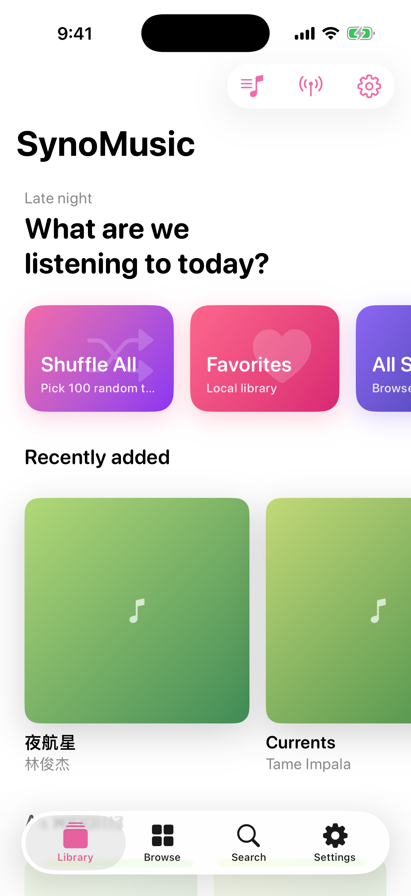
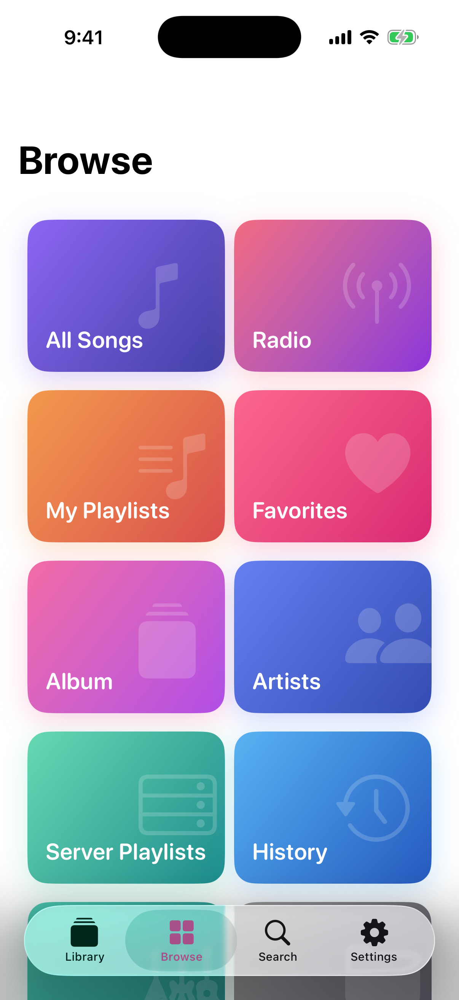
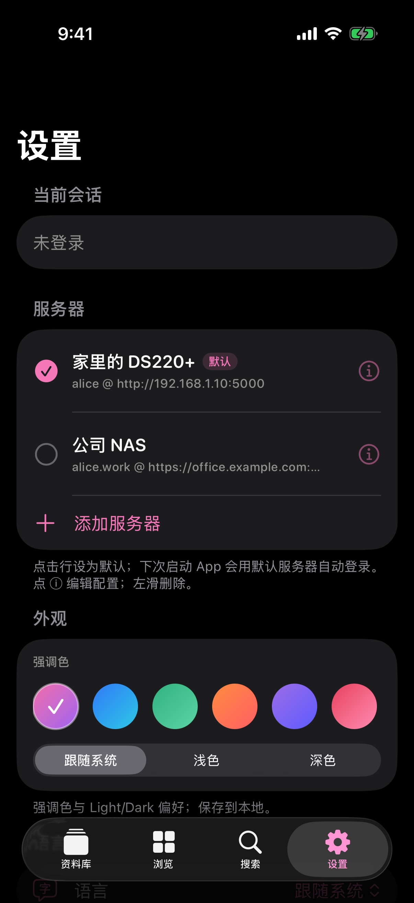
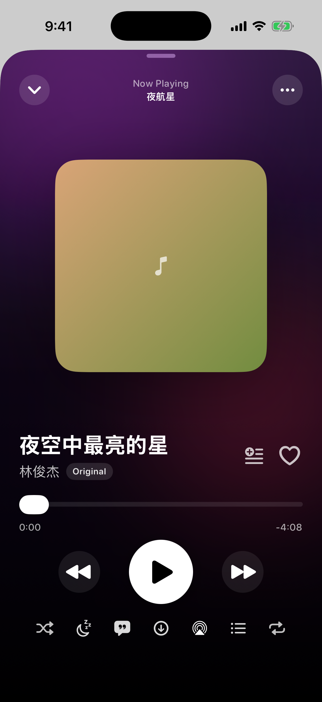
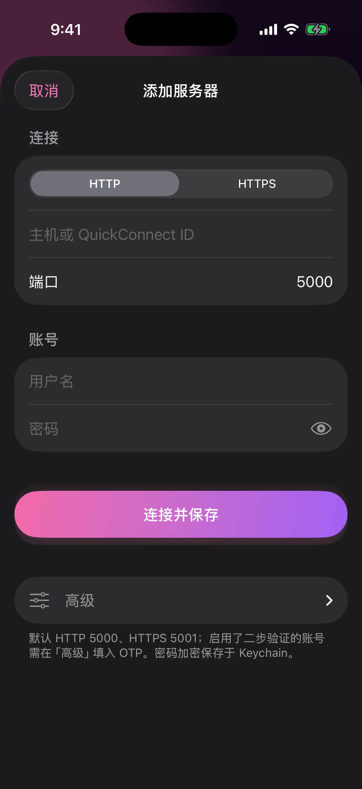

# SynoMusic

> Synology NAS 向けの、美しいネイティブ iOS 音楽クライアント — Audio Station ベース。

[English](README.md) · [简体中文](README.zh.md) · [日本語](README.ja.md) · [한국어](README.ko.md)

SynoMusic は DSM の Audio Station Web API を介して、洗練された iOS ネイティブ体験を提供します：ライブラリ閲覧、検索、再生、ローカルプレイリスト、世界のラジオ、ロック画面と Dynamic Island での完全制御。

## スクリーンショット

|  ライブラリ  |  ブラウズ  |  設定  |
| :---: | :---: | :---: |
|  |  |  |

|  プレーヤー  |  サーバー設定  |
| :---: | :---: |
|  |  |

## 最新リリース：1.2.9

- App アイコンとプレビュー画像アセットをさらに圧縮し、パッケージサイズを削減しました。
- 1.2.8 のプレーヤーダウンロード、歌詞、アルバムアート、QuickConnect リレー改善も含みます。
- 詳細は [`CHANGELOG.md`](CHANGELOG.md) を参照してください。

## 機能

- **NAS ファースト**：複数サーバー、Keychain、2 段階認証（OTP）、自己署名証明書、HTTPS / QuickConnect
- **ストリーミング**：AVQueuePlayer、原音 → MP3 自動フォールバック、AirPlay、リモートコマンドセンター
- **ライブラリ**：アルバム / アーティスト / ジャンル / フォルダ / サーバーリスト / *すべての曲*
- **ローカルプレイリスト**：複数のカスタム、組み込み「お気に入り」、一括編集、複数選択
- **ラジオ**：Radio-Browser API による 30,000+ の世界の局
- **プレーヤー**：フルスクリーン、同期歌詞、キュー編集、スリープタイマー、ジャケット ↔ 歌詞切替
- **システム連携**：ロック画面の Now Playing、Dynamic Island Live Activity、リモートコマンド
- **テーマ**：8 色のアクセント + システム / ライト / ダーク
- **多言語**：簡体字中国語、繁体字中国語、英語、日本語、韓国語、ドイツ語、フランス語

## 必要環境

- **iOS 17 以降** の iPhone
- Synology NAS に **Audio Station** がインストールされ、対象ユーザーに権限が付与されていること
- Dynamic Island：iPhone 14 Pro 以降

## ソースからビルド

```bash
brew install xcodegen
git clone https://github.com/ZanwingMak/SynoMusic.git
cd SynoMusic
xcodegen generate
open SynoMusic.xcodeproj
```

## サポート

- **PayPal** — [paypal.me/zanwing](https://paypal.me/zanwing)
- **Buy Me a Coffee** — [buymeacoffee.com/zanwing](https://buymeacoffee.com/zanwing)
- **Wise** — [wise.com/pay/me/zhenyingm1](https://wise.com/pay/me/zhenyingm1)
- **WeChat / Alipay** — アプリ内の「設定 → サポートする」から QR

## ライセンス

本プロジェクトは **GNU GPL v3.0** の下でライセンスされています。詳しくは [`LICENSE`](LICENSE) を参照。

> SynoMusic は非公式の Audio Station クライアントです。*Synology*、*DSM*、*Audio Station* は Synology Inc. の商標です。
